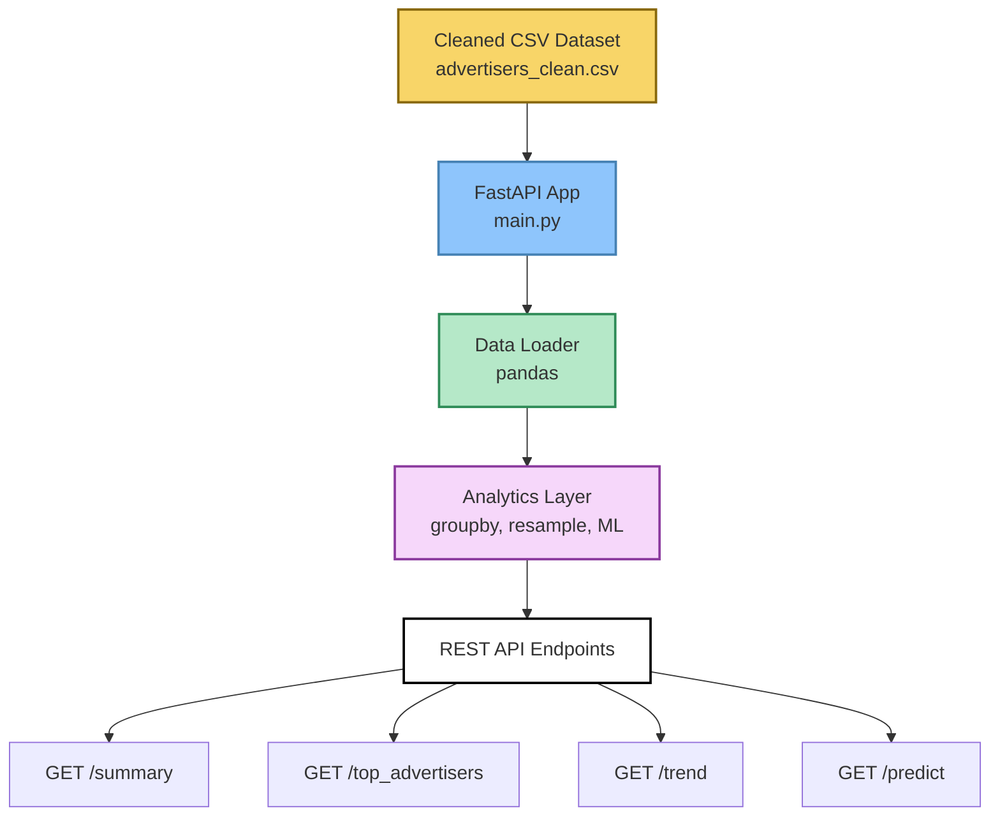

# ⭐ Advertiser Analytics API — FastAPI Microservice
🌍 Live API Access  
➡️ Swagger UI → https://advertiser-analytics-api.onrender.com/docs  
➡️ Health Check → https://advertiser-analytics-api.onrender.com/health  
➡️ Top Advertisers → https://advertiser-analytics-api.onrender.com/top_advertisers

A lightweight analytics microservice that exposes advertiser revenue, order volume, customer activity, trends, and predictions through clean REST APIs. Built with FastAPI, pandas, and scikit-learn, this project transforms a cleaned advertiser dataset into a real backend analytics service.

---

## 🚀 Features
- Loads & cleans advertiser data from CSV  
- Computes metrics (revenue, orders, customers)  
- Identifies top advertisers  
- Generates daily/weekly/monthly revenue trends  
- Predicts future revenue using linear regression  
- Clean, professional FastAPI project structure  
- Uses virtual environment + requirements.txt  

---

## 🛠️ Tech Stack
- Python 3.13  
- FastAPI  
- Uvicorn  
- Pandas  
- NumPy  
- scikit-learn  

---

## 📁 Project Structure
```
advertiser-analytics-api/
│
├── app/
│   ├── main.py               # FastAPI app + endpoints
│   └── __init__.py
│
├── data/
│   └── advertisers_clean.csv # Cleaned dataset
│
├── venv/                     # ignored by git
│
├── .gitignore
├── requirements.txt
└── README.md
```

---

## 🧠 Architecture Diagram


---

## ▶️ How to Run Locally

### 1️⃣ Create & activate virtual environment
```
python -m venv venv
venv\Scripts\activate
```

### 2️⃣ Install dependencies
```
pip install -r requirements.txt
```

### 3️⃣ Start the API server
```
uvicorn app.main:app --reload
```

### 4️⃣ Open in browser
- Swagger API docs → http://127.0.0.1:8000/docs  
- Redoc → http://127.0.0.1:8000/redoc  

---

## 📡 API Endpoints

### 🔹 Health Check  
`GET /health`  
Returns dataset info (rows, columns, status).

### 🔹 Summary KPIs  
`GET /summary`  
Example:
```
{
  "total_revenue": 18923492.19,
  "total_orders": 482399,
  "total_customers": 49113
}
```

### 🔹 Top Advertisers  
`GET /top_advertisers?limit=5`  
Returns advertisers ranked by total revenue.

### 🔹 Revenue Trend  
`GET /trend?freq=D`  
- D = daily  
- W = weekly  
- M = monthly  

### 🔹 Revenue Prediction  
`GET /predict?days=7`  
Predicts future revenue using linear regression.

Example:
```
[
  {"date": "2024-02-10", "predicted_revenue": 12231.44},
  {"date": "2024-02-11", "predicted_revenue": 11982.01}
]
```

---

## 🚀 Future Improvements
- Deploy to Render / Railway / AWS  
- Add authentication / API keys  
- Add richer forecasting models  
- Add visualization endpoints  
- Add Postgres or Snowflake backend integration  

---

## 📄 License
MIT License
